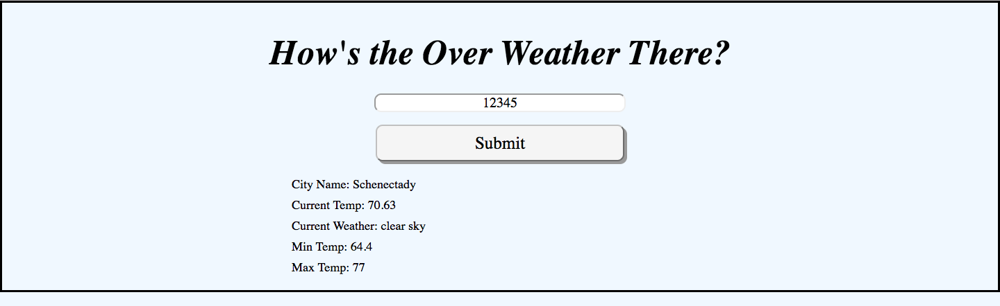

# WeatherApp
> A small weather app that also tells the temperature.

[![Build Status][travis-image]][travis-url]

	https://yamilburgos.github.io/WeatherApp

## Meta
[Yamil Burgos](https://github.com/yamilburgos/) – yamil.burgos1293@gmail.com

## Contributing
1. Fork it (<https://github.com/yamilburgos/WeatherApp/fork>)
2. Create your feature branch (`git checkout -b feature/fooBar`)
3. Commit your changes (`git commit -am 'Add some fooBar'`)
4. Push to the branch (`git push origin feature/fooBar`)
5. Create a new Pull Request

<!-- Markdown link & img dfn's -->
[npm-image]: https://img.shields.io/npm/v/datadog-metrics.svg?style=flat-square
[npm-url]: https://npmjs.org/package/datadog-metrics
[travis-image]: https://img.shields.io/travis/dbader/node-datadog-metrics/master.svg?style=flat-square
[travis-url]: https://travis-ci.org/dbader/node-datadog-metrics